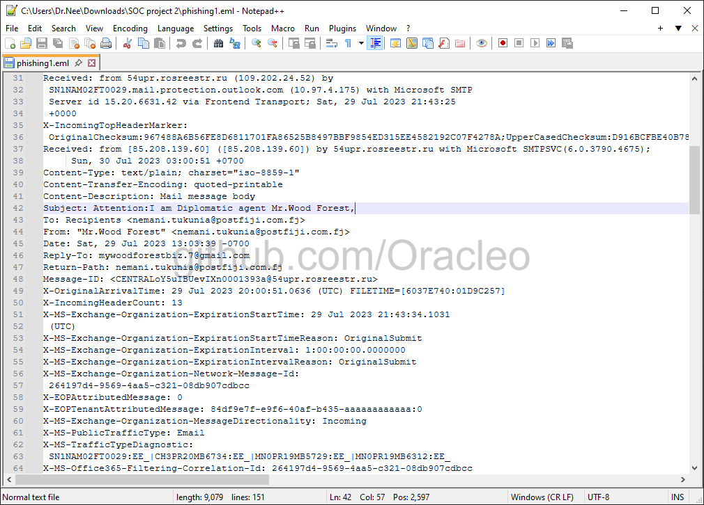
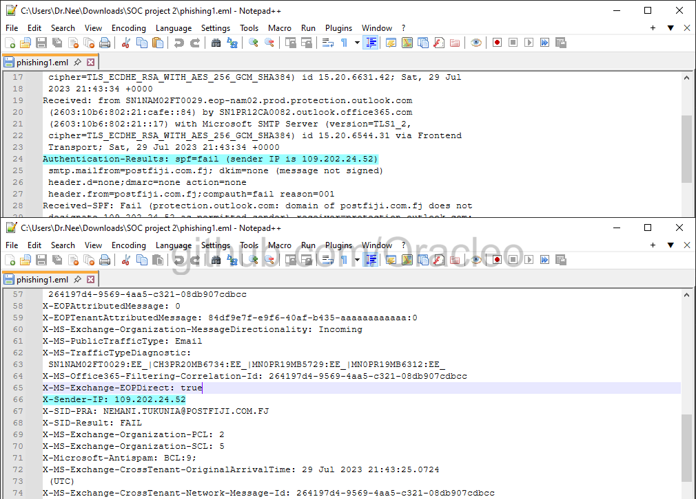
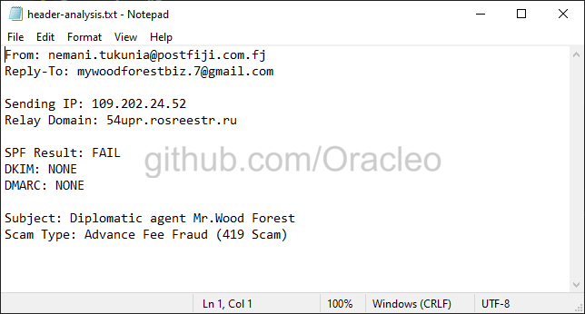
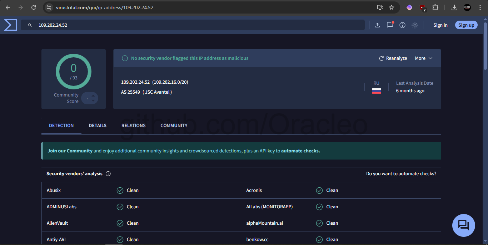
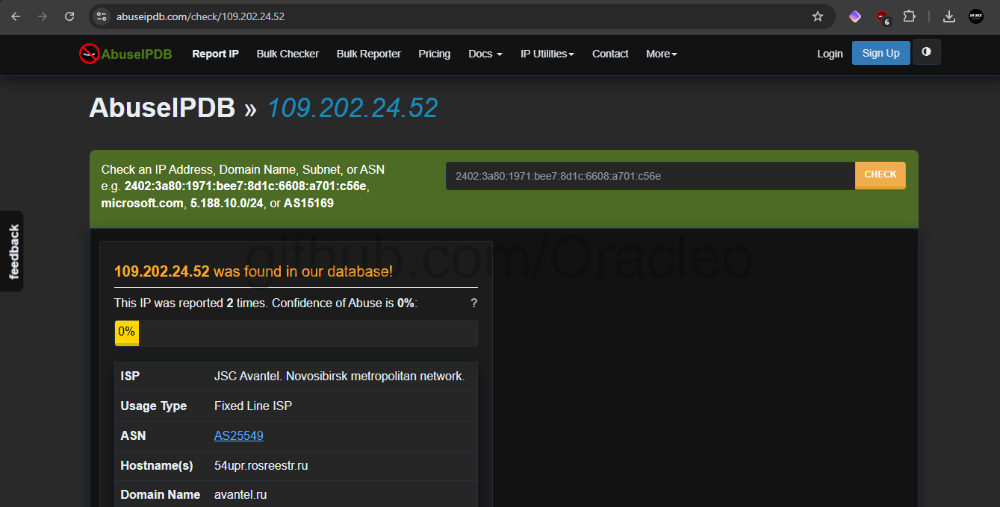
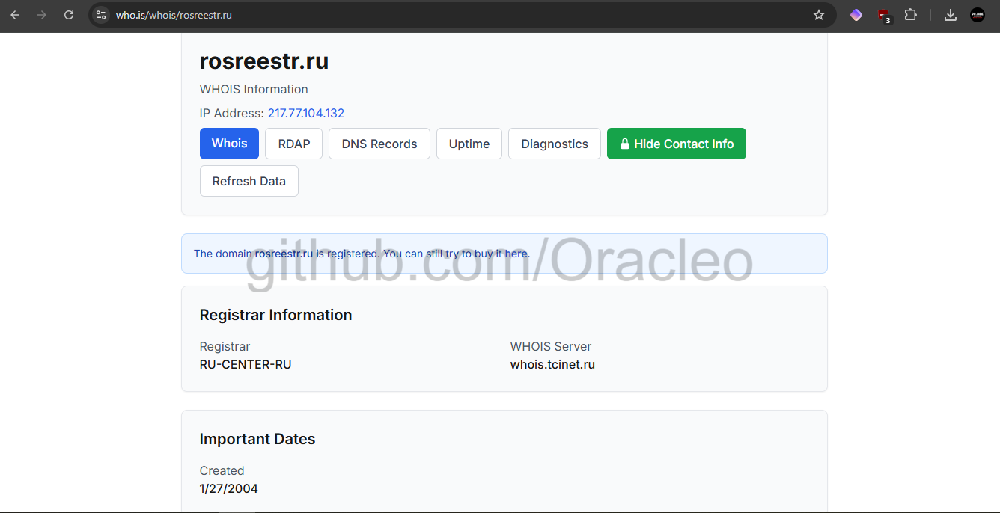
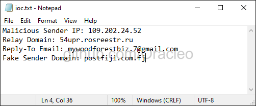
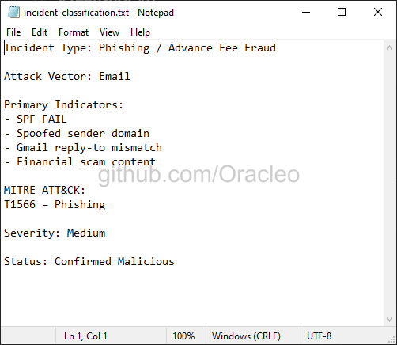

# Social Engineering Risk Assessment & Incident Reporting | Email Forensics


**A structured social engineering risk assessment and incident report based on a live phishing email — covering email header analysis, SPF/DKIM/DMARC authentication verification, IOC extraction, threat intelligence enrichment, and a GRC-grade incident report with business impact analysis, control recommendations, and ISO 27001/NIST CSF mapping.**

---

## 📋 Table of Contents

1. [GRC Relevance — Why This Project](#-grc-relevance--why-this-project)
2. [Incident Summary](#-incident-summary)
3. [Assessment Methodology](#-assessment-methodology)
4. [Technical Analysis](#-technical-analysis)
5. [Threat Intelligence Enrichment](#-threat-intelligence-enrichment)
6. [Indicators of Compromise](#-indicators-of-compromise)
7. [MITRE ATT&CK Mapping](#-mitre-attck-mapping)
8. [Incident Classification & Risk Rating](#-incident-classification--risk-rating)
9. [Risk Register Entry & Control Recommendations](#-risk-register-entry--control-recommendations)
10. [GRC Concepts Applied](#-grc-concepts-applied)
11. [Screenshots Index](#-screenshots-index)
12. [Repository Structure](#-repository-structure)

---

## 🎯 GRC Relevance — Why This Project

Social engineering risk assessment is a direct GRC responsibility. Human-targeted attacks represent one of the highest-frequency, highest-impact risk vectors facing any organisation — and GRC functions own the controls designed to prevent, detect, and respond to them. A GRC analyst engaging with a phishing incident is expected to:

- Assess the technical control failures that allowed the email to reach the recipient
- Evaluate the organisation's email authentication posture (SPF, DKIM, DMARC)
- Extract and document IOCs for distribution to security infrastructure
- Produce an incident report with business impact analysis and risk classification
- Recommend control improvements mapped to ISO 27001 and NIST CSF
- Assess third-party risk where spoofed or compromised external domains are involved
- Evaluate user awareness training adequacy as a preventive control

This project simulates that workflow end-to-end using a **real phishing email sample**. The email was investigated manually — header analysis, authentication verification, IOC extraction, threat intelligence enrichment via VirusTotal, AbuseIPDB, and WHOIS — and a complete GRC incident report was produced.

**Outcome: Phishing confirmed as Advance Fee Fraud (T1566). SPF failure, zero DKIM/DMARC, compromised Russian relay infrastructure, and Gmail reply-to mismatch identified. Incident classified Medium severity. Full IOC set documented. Control gap analysis and recommendations produced.**

> 💡 **GRC Context:** ISO 27001 Annex A.6.3 (Information security awareness, education, and training) and A.5.24 (Information security incident management planning) both mandate that organisations have processes to detect, investigate, and respond to social engineering attacks. NIST CSF DE.CM-3 (Personnel activity is monitored to detect potential cybersecurity events) and RS.AN-1 (Notifications from detection systems are investigated) require documented investigation workflows. This project demonstrates both the investigative process and the governance documentation those controls require.

---

## 📊 Incident Summary

| Field | Detail |
|---|---|
| **Incident Type** | Phishing — Advance Fee Fraud (419 Scam) |
| **Attack Vector** | Email |
| **MITRE ATT&CK** | T1566 — Phishing / TA0001 — Initial Access |
| **Severity** | 🟡 Medium |
| **Status** | ✅ Confirmed Malicious |
| **Spoofed Sender** | nemani.tukunia@postfiji.com.fj |
| **Attacker Reply-To** | mywoodforestbiz.7@gmail.com |
| **Sender IP** | 109.202.24.52 (Russia — JSC Avantel, ASN 25549) |
| **Relay Domain** | 54upr.rosreestr.ru (compromised Russian govt. domain) |
| **SPF Result** | ❌ FAIL |
| **DKIM Result** | ❌ NONE |
| **DMARC Result** | ❌ NONE |
| **ISO 27001 Controls** | A.6.3, A.5.24, A.5.6, A.8.16 |
| **NIST CSF** | DE.CM-3, RS.AN-1, PR.AT-1, ID.RA-2 |

---

## 🔧 Assessment Methodology

This investigation followed a structured six-phase social engineering risk assessment methodology — replicating the process a GRC analyst would apply when reviewing a reported phishing incident.

```
Phase 1 — Evidence Preservation
         └─► Email acquired in .eml format to preserve complete
             header chain and message content for forensic integrity

Phase 2 — Header Analysis & Authentication Verification
         └─► SPF, DKIM, DMARC results extracted and evaluated
             Routing path traced — sender IP and relay domain identified

Phase 3 — IOC Extraction
         └─► Malicious indicators documented:
             sender IP, relay domain, reply-to address, spoofed domain

Phase 4 — Threat Intelligence Enrichment
         └─► Each IOC submitted to VirusTotal, AbuseIPDB, WHOIS
             Infrastructure geolocation and ownership confirmed

Phase 5 — Social Engineering Assessment
         └─► Content analysed for manipulation tactics, urgency creation,
             information requests, and fraud pattern classification

Phase 6 — Incident Classification & GRC Documentation
         └─► Severity rated, MITRE ATT&CK mapped, control gaps identified
             Risk register entry and remediation recommendations produced
```

---

## 📊 Technical Analysis

### Email Header Analysis

**Raw email headers — full routing path preserved:**



The complete header chain documents the transmission path from originating IP through relay infrastructure to the recipient mail server — providing the forensic evidence base for the investigation.

---

### Email Authentication Results

**SPF — FAIL:**



```
spf=fail (sender IP is 109.202.24.52)
```

The sending IP address 109.202.24.52 is not listed as an authorised sender in the SPF record for the claimed sender domain `postfiji.com.fj`. This failure is definitive evidence that the email either originated from spoofed sender infrastructure or was transmitted through an unauthorised relay.

**DKIM — NONE:** No DKIM signature present. Without cryptographic signing there is no mechanism to verify message origin or content integrity in transit.

**DMARC — NONE:** No DMARC policy published by the sender domain. This eliminates organisational email handling enforcement and means no automated rejection or quarantine instruction exists for authentication failures.

**Authentication Summary:**

| Control | Result | GRC Implication |
|---|---|---|
| SPF | ❌ FAIL | Sending IP unauthorised — domain spoofed or relay compromised |
| DKIM | ❌ NONE | No cryptographic message integrity verification |
| DMARC | ❌ NONE | No organisational email policy enforcement — control gap |

All three email authentication controls absent or failed. This constitutes a complete email authentication control failure — both at the sender domain and in the receiving organisation's enforcement configuration.

---

### Header Analysis Summary



**Sender Information:**

| Field | Value | Risk Signal |
|---|---|---|
| Displayed Sender | nemani.tukunia@postfiji.com.fj | Impersonating Post Fiji — legitimate national postal service |
| Reply-To | mywoodforestbiz.7@gmail.com | ⚠️ Redirect to free email — definitive phishing indicator |
| Sender IP | 109.202.24.52 | Russia (JSC Avantel) — geographically inconsistent with Fiji claim |
| Relay Domain | 54upr.rosreestr.ru | Russian government subdomain — likely compromised |

**Sender/Reply-To mismatch — GRC significance:** The reply-to header redirects all responses to a Gmail address rather than the claimed sender domain. Legitimate organisational communications maintain consistent sender and reply-to domain alignment. This mismatch is a definitive indicator of fraudulent intent and also demonstrates third-party infrastructure risk — the attacker controls the reply-to channel without needing to compromise the spoofed domain.

---

### Social Engineering Content Assessment

**Subject:** `Attention: I am Diplomatic agent Mr.Wood Forest`

**Manipulation Tactics Identified:**

| Tactic | Implementation | Classification |
|---|---|---|
| Authority | Diplomatic agent impersonation | Social engineering — authority exploitation |
| Greed | $10.5M USD claim | Advance fee fraud trigger |
| Urgency | Immediate action required for delivery | Pressure tactic to bypass rational evaluation |
| Information Harvesting | Name, address, phone, occupation requested | PII collection for identity theft / targeted fraud |

**Risk of Victim Compliance:** Responding provides sufficient PII to conduct identity theft, open fraudulent accounts, or launch targeted spearphishing against the victim's contacts — escalating the incident scope beyond the initial phishing attempt.

---

## 🔍 Threat Intelligence Enrichment

### VirusTotal — IP Reputation



**IP 109.202.24.52 — 0/93 vendor detections**

**GRC Analysis — False Negative Significance:**

Zero automated detections despite confirmed malicious activity. This demonstrates a critical principle for GRC risk assessment: **automated reputation scores are a lagging indicator, not a definitive verdict.** Attackers frequently use newly established or infrequently abused infrastructure that has not accumulated sufficient reports to trigger high-confidence automated blocking.

This is a **false negative** — delivered as clean by automated email gateway filtering despite being malicious. It directly supports the GRC argument for defence-in-depth: layering technical filtering, authentication enforcement, user awareness training, and manual investigation procedures as complementary controls that compensate for each other's blind spots.

---

### AbuseIPDB Correlation



| Field | Value |
|---|---|
| Abuse Reports | 2 previous reports |
| Confidence Score | 0% |
| ISP | JSC Avantel — Novosibirsk metropolitan network |
| Hostname | 54upr.rosreestr.ru |
| ASN | AS25549 |

Hostname resolution to `54upr.rosreestr.ru` confirmed the relay infrastructure identified in header analysis. Low confidence score at time of investigation is consistent with infrequently abused infrastructure — a common characteristic of targeted, low-volume campaigns designed specifically to evade reputation-based filtering.

---

### WHOIS Domain Investigation



| Field | Value |
|---|---|
| Domain | rosreestr.ru |
| Registrar | RU-CENTER-RU |
| Created | January 27, 2004 |
| Primary IP | 217.77.104.132 |
| Status | Active — legitimate Russian government domain |

**Third-Party Risk Assessment:** `rosreestr.ru` is the legitimate domain of Russia's Federal Service for State Registration, Cadastre and Cartography. The subdomain `54upr.rosreestr.ru` used for relay resolves to a different IP (109.202.24.52) than the parent domain (217.77.104.132) — indicating the subdomain was specifically configured for malicious relay, either through infrastructure compromise or DNS abuse. This is a supply chain / third-party infrastructure risk: a trusted, long-established government domain being abused to evade domain-reputation-based blocking.

---

### Threat Intelligence Synthesis

| IOC | Platform | Result | Assessment |
|---|---|---|---|
| 109.202.24.52 | VirusTotal | 0/93 detections | False negative — not yet flagged |
| 109.202.24.52 | AbuseIPDB | 2 reports, 0% confidence | Low-volume abuse history |
| 54upr.rosreestr.ru | WHOIS | Legitimate govt. domain | Subdomain likely compromised |
| mywoodforestbiz.7@gmail.com | Manual | Free email provider | Attacker-controlled reply address |
| postfiji.com.fj | SPF check | SPF FAIL | Domain spoofed |

**Synthesis conclusion:** No single indicator was sufficient alone. The combination of SPF failure + DKIM/DMARC absence + Russian infrastructure + Fiji sender spoofing + Gmail reply-to mismatch + advance fee fraud content = confirmed phishing with high confidence. Multi-signal correlation is the correct methodology for GRC incident assessment when automated tools fail.

---

## 🚨 Indicators of Compromise



| IOC Type | Value | Recommended Action |
|---|---|---|
| **Sender IP** | 109.202.24.52 | Block in email gateway and perimeter firewall |
| **Relay Domain** | 54upr.rosreestr.ru | Block subdomain in email gateway |
| **Reply-To Address** | mywoodforestbiz.7@gmail.com | Block in email gateway; add to phishing blacklist |
| **Spoofed Domain** | postfiji.com.fj | Enforce strict inbound SPF validation |
| **Subject Pattern** | "Diplomatic agent" + personal name | Email gateway content rule |
| **Auth Pattern** | SPF FAIL + No DKIM + No DMARC + Reply-To mismatch | Automated quarantine rule |

**IOC Distribution:** Submit to organisational SIEM for alerting, email gateway for blocking rules, endpoint security for monitoring, and security team for awareness. Retain as evidence for ISO 27001 A.5.24 incident management audit requirements.

---

## 🎯 MITRE ATT&CK Mapping

| Field | Detail |
|---|---|
| **Tactic** | Initial Access — TA0001 |
| **Technique** | Phishing — T1566 |
| **Sub-technique** | T1566.003 — Spearphishing via Service (Gmail as attacker-controlled delivery mechanism) |
| **Reference** | https://attack.mitre.org/techniques/T1566/ |

**MITRE Mitigations Applicable:**

| ID | Mitigation |
|---|---|
| M1054 | Software Configuration — enforce DMARC reject policy |
| M1017 | User Training — awareness of advance fee fraud and auth failure indicators |
| M1031 | Network Intrusion Prevention — email gateway authentication enforcement |
| M1049 | Antivirus/Antimalware — supplement with authentication-based detection |

---

## 🔐 Incident Classification & Risk Rating



**Severity: 🟡 Medium**

| Factor | Assessment |
|---|---|
| Delivery success | ✅ Reached inbox — existing controls failed |
| Social engineering sophistication | 🟡 Moderate — authority + greed, plausible sender impersonation |
| Immediate compromise risk | 🟢 Lower — no malicious link or attachment in initial message |
| Escalation potential | 🟠 High — victim response enables PII theft and targeted follow-up |
| Authentication control failures | 🔴 Complete — SPF/DKIM/DMARC all absent or failed |
| Third-party risk | 🟠 Present — compromised government relay infrastructure |

**Confirmed Malicious** — despite 0/93 VirusTotal detections, multi-signal manual analysis confirms phishing with high confidence. This case demonstrates why automated tools cannot replace structured investigation methodology.

---

## 📋 Risk Register Entry & Control Recommendations

### Risk Register Entry

| Field | Value |
|---|---|
| **Risk ID** | RISK-SE-001 |
| **Asset** | Organisational email system / end users |
| **Threat** | Social engineering via phishing — external attacker |
| **Vulnerability** | Absent email authentication enforcement; user susceptibility to social engineering |
| **Likelihood** | High — phishing is the #1 initial access vector globally |
| **Impact** | Medium — PII exposure, credential theft, identity fraud escalation potential |
| **Inherent Risk** | High |
| **Current Controls** | Email gateway filtering (insufficient — failed to detect) |
| **Control Gap** | No DMARC reject policy; no SPF quarantine action; user awareness training gap |
| **Residual Risk** | Medium |
| **ISO 27001** | A.6.3, A.5.24, A.5.6, A.8.16 |
| **NIST CSF** | PR.AT-1, DE.CM-3, RS.AN-1, ID.RA-2 |

---

### Control Recommendations

**Immediate — DMARC Enforcement:**
Implement DMARC `p=reject` for all organisational domains. This single control would have prevented delivery of this email entirely. Enforce SPF quarantine or reject action for SPF failures. Configure email gateway to quarantine messages with sender/reply-to domain mismatches involving free email providers. Block all identified IOCs immediately.

Maps to ISO 27001 A.8.16 and NIST CSF DE.CM-3.

**Short-term — Authentication Hardening:**
Audit SPF, DKIM, and DMARC records for all owned domains. Implement DKIM signing for all outbound mail. Progress DMARC to `p=reject` after monitoring period confirms no legitimate mail impact. Configure email gateway correlation rules that quarantine messages presenting multiple weak signals simultaneously — SPF fail + no DKIM + reply-to mismatch — even when individual confidence scores are low.

Maps to ISO 27001 A.5.6 and A.8.16.

**Medium-term — User Awareness:**
Update security awareness training to cover advance fee fraud patterns, authentication failure recognition, sender/reply-to mismatch identification, and phishing reporting procedures. Conduct simulated phishing exercises using this pattern. Track report rates as a GRC KPI.

Maps to ISO 27001 A.6.3 and NIST CSF PR.AT-1.

**Ongoing — Threat Intelligence:**
Implement threat intelligence feeds correlating multiple weak indicators rather than relying on single high-confidence blocks. Integrate IOC sharing with sector-relevant ISACs. Retain all investigation records as ISO 27001 A.5.24 incident management evidence.

Maps to NIST CSF ID.RA-2.

---

## 📚 GRC Concepts Applied

| Concept | Application in This Project |
|---|---|
| Social Engineering Risk Assessment | Live phishing email assessed across technical, content, and infrastructure dimensions |
| Third-Party Risk | Compromised government relay domain assessed as supply chain risk vector |
| Email Authentication Control Evaluation | SPF, DKIM, DMARC assessed — complete control failure documented |
| IOC Extraction & Documentation | Structured IOC set produced for security infrastructure distribution |
| Threat Intelligence Enrichment | VirusTotal, AbuseIPDB, WHOIS correlated — false negative scenario identified |
| False Negative Analysis | 0/93 detections despite confirmed malicious — demonstrates limits of automated tools |
| Incident Classification | Multi-factor severity rating framework applied |
| Risk Register Entry | RISK-SE-001 produced in GRC risk register format |
| Business Impact Analysis | PII exposure, identity theft, credential harvesting escalation paths assessed |
| ISO 27001 Mapping | A.6.3, A.5.24, A.5.6, A.8.16 mapped to findings and recommendations |
| NIST CSF Mapping | PR.AT-1, DE.CM-3, RS.AN-1, ID.RA-2 mapped to control gaps |
| MITRE ATT&CK Mapping | T1566 / TA0001 with sub-technique T1566.003 |
| Defence-in-Depth Rationale | Technical + authentication + awareness + threat intel controls documented |

### Key Questions to Prepare From This Project

**Q: How does a phishing investigation feed into the GRC risk register?**
The incident becomes a risk entry — asset is the email system and end users, threat is social engineering, vulnerability is absent authentication controls and user susceptibility. The investigation provides the evidence base for likelihood and impact scoring. Control recommendations become treatment actions with owners and timelines assigned in the register.

**Q: What is DMARC and why does it matter to GRC?**
DMARC is a DNS policy record instructing receiving mail servers to quarantine or reject messages failing SPF or DKIM validation. In GRC terms it is a preventive control under ISO 27001 A.8.16. A missing or permissive DMARC policy is a control gap auditors will flag. A `p=reject` policy would have prevented this email from reaching the recipient inbox entirely.

**Q: Why was this classified Medium severity despite complete authentication failure?**
Severity is likelihood multiplied by impact. Authentication failure represents a control gap — but immediate harm required active victim engagement. No executable payload, malicious URL, or credential harvesting form was present. Had the email contained a malicious attachment or link the classification would escalate to High or Critical immediately.

**Q: What does the zero VirusTotal detection result mean for GRC?**
It demonstrates that automated tools are insufficient as a sole control — a false negative that was manually resolved through structured investigation. From a GRC perspective this is the business case for defence-in-depth: layering authentication enforcement, content analysis, user training, and investigation procedures so that failure of any single control does not result in undetected compromise.

**Q: How does third-party risk apply here?**
The compromised relay domain `rosreestr.ru` is a legitimate government entity whose infrastructure was abused for phishing relay. This illustrates that attackers exploit trusted third-party infrastructure specifically to evade domain-reputation controls. It supports including email relay abuse scenarios in third-party risk assessment questionnaires and evaluating subdomains independently of their parent domain reputation.

---

## 📸 Screenshots Index

| # | Filename | Description |
|---|---|---|
| 01 | GRC3-01-email-header.png | Raw email headers — full routing path |
| 02 | GRC3-02-spf-fail.png | SPF authentication failure detail |
| 03 | GRC3-03-header-analysis.png | Structured header analysis summary |
| 04 | GRC3-04-ioc-list.png | Extracted IOC set — all four indicators |
| 05 | GRC3-05-virustotal-ip.png | VirusTotal — 0/93 detections (false negative) |
| 06 | GRC3-06-abuseipdb.png | AbuseIPDB — 2 reports, 0% confidence |
| 07 | GRC3-07-whois-domain.png | WHOIS — rosreestr.ru registration details |
| 08 | GRC3-08-incident-classification.png | Final incident classification document |

---

## 📁 Repository Structure

```
GRC3-Social-Engineering-Risk-Assessment/
│
├── README.md                        ← Complete assessment documentation
├── incident-report.md               ← Formal GRC incident report
├── header-analysis.txt              ← Email header analysis summary
├── ioc.txt                          ← Extracted indicators of compromise
├── threat-intel.txt                 ← Threat intelligence enrichment findings
├── incident-classification.txt      ← Final incident classification
├── phishing_sample.eml              ← Original email sample (preserved)
│
└── screenshots/                     ← 8 annotated evidence screenshots
    ├── GRC3-01-email-header.png
    ├── GRC3-02 through GRC3-08 ...
```

---

## ⚖️ Disclaimer

> This investigation was conducted using a real phishing email sample for educational and professional development purposes. The methodologies demonstrated should only be applied to emails within authorised organisational environments or designated security training platforms. No interaction was made with any links, attachments, or attacker infrastructure. All analysis was conducted in a safe, read-only manner against header data, threat intelligence platforms, and WHOIS records.

---

<div align="center">

*GRC3 · Email Forensics · VirusTotal · AbuseIPDB · WHOIS · MITRE ATT&CK T1566*

*Social Engineering Risk Assessment · Third-Party Risk · ISO 27001 · NIST CSF · Incident Reporting · IOC Analysis*

</div>
